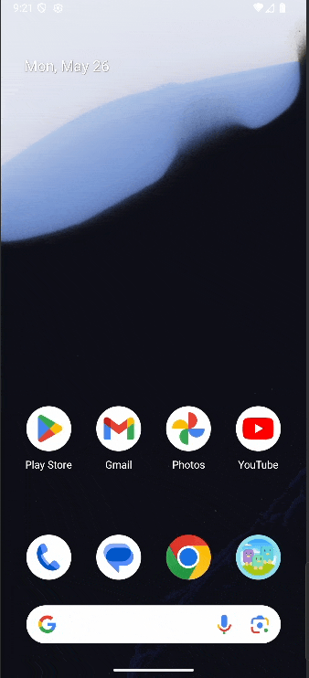
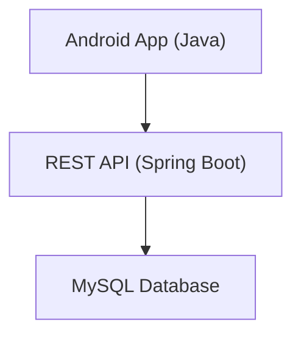

# 🪶 Out of the Nest – Android App

**Find safe and enjoyable places for the family.**  
Out of the Nest is a mobile application designed to help families find welcoming and accessible locations — including restaurants, parks, events, or pet-friendly places.

Whether you’re looking for a **restaurant with a playground**, a **family event**, or a **pet-friendly park**, this app provides a smooth, map-based experience powered by Google Maps and a robust backend API.

<p align="center">
  
</p>
---

## 🌟 Features

- Find nearby family-friendly and pet-friendly locations  
- Filter by amenities (washrooms, playgrounds, kids’ menus, etc.)  
- Interactive map using **Google Maps SDK**  
- Authentication with **Firebase Auth**  
- Push notifications with **Firebase Cloud Messaging (FCM)**  
- Real-time data from a **Spring Boot + MySQL backend API**  

---

## 🧩 System Architecture



**Frontend (Mobile)**  
- Built with **Android Studio** and **Gradle**  
- Uses **Retrofit** for API calls and **Glide** for images  
- Integrated with **Firebase** for Auth and Messaging  

**Backend**  
- Hosted separately: [Out of the Nest API](https://github.com/rodrigobruner/out_of_the_nest_android_api)  
- Java 17, Spring Boot 3, MyBatis, MySQL  

---

## ⚙️ Configuration & Setup

### 1. Clone the Repository
```
git clone https://github.com/rodrigobruner/out_of_the_nest_android_app.git
cd out_of_the_nest_android_app/Outofthenest
```

### 2. Configure `local.properties`
```
sdk.dir=/path/to/your/Android/Sdk
MAPS_API_KEY=your_google_maps_api_key
API_BASE_URL=https://your-api-domain.com
```

### 3. Add Firebase Configuration
Place your `google-services.json` inside:
```
app/src/
```
If you don’t have it, create a Firebase project → add Android app → download `google-services.json`.

### 4. Build the App
```
./gradlew assembleRelease
```

---

## 🚀 Deployment

### Google Play Store
```
./gradlew bundleRelease
```
Then upload `app/build/outputs/bundle/release/app-release.aab` to Play Console.

### Firebase App Distribution
```
./gradlew assembleRelease
```
Distribute via Firebase Console or CLI.

### Direct APK Distribution
```
./gradlew assembleRelease
```
Result: `app/build/outputs/apk/release/app-release.apk`

---

## 🧪 Testing & Quality Checklist

- ✅ All strings translated to English  
- ✅ Debug logs removed  
- ✅ Notification date parsing verified  
- ✅ API integrations tested  
- ✅ Dependencies updated to latest stable versions  

---

## 🧱 Tech Stack

| Layer | Technology |
|-------|-------------|
| **Language** | Java |
| **UI Framework** | Android SDK, ConstraintLayout, Material Design |
| **Networking** | Retrofit + Gson |
| **Auth & Push** | Firebase Auth & Messaging |
| **Mapping** | Google Maps SDK, Android Maps Utils |
| **Backend** | Spring Boot API (linked below) |
| **Database (Remote)** | MySQL via REST |

---

## 🧩 Related Repositories

- 📱 **Android App:** [out_of_the_nest_android_app](https://github.com/rodrigobruner/out_of_the_nest_android_app)
- ⚙️ **Backend API:** [out_of_the_nest_android_api](https://github.com/rodrigobruner/out_of_the_nest_android_api)

